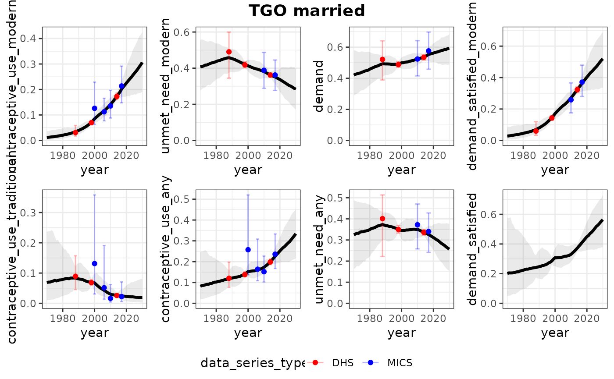
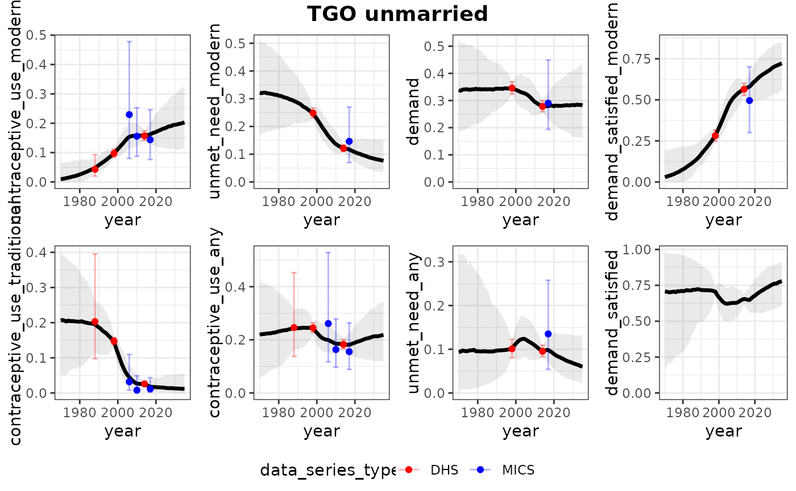
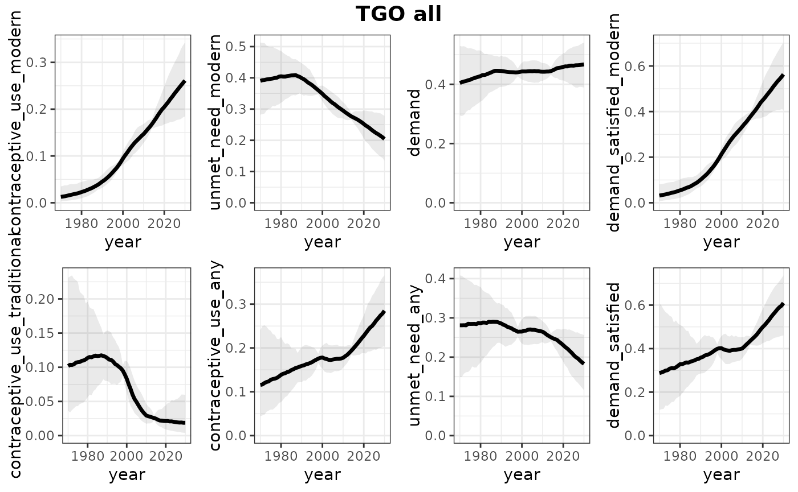

# FPET: Local fitting for national estimation for all women

## Introduction

In this vignette we obtain national estimates of FP indicators for all
women. We use local fits.

``` r
library(fpet2)
options(cmdstanr_warn_inits = FALSE)
```

## Read data for all countries

We use the Track20 survey data base and the UNPD population estimates:

``` r
data_folder <- here::here("data-raw")
survey_data_file <- file.path(data_folder, "Track20 2025 Database for FPET2 051325.csv")
nat_population_data_file <- file.path(data_folder, "population_counts.rds")
# read inputs
survey_df_all <- readr::read_csv(survey_data_file, show_col_types = FALSE)
population_df_all <- readRDS(nat_population_data_file)
```

## Model fitting

First choose a country (division_numeric_code and country names are
available in
[`fpet2::regions_all`](https://alkemalab.github.io/fpet2/reference/regions_all.md)):

``` r
division_numeric_code_select <- 768 # Togo
```

Note that in the current package, the model needs to be compiled once,
this takes a little while. (Note: In the 2024 version, we packaged up
the model using `instantiate`, we can consider that again here too).

There will be text indicating what model assumptions are made for
married women, followed by assumptions for unmarried women.

``` r
results_national <- fit_fpem(
  survey_df = survey_df_all |>
    dplyr::filter(division_numeric_code == division_numeric_code_select),
  population_df = population_df_all |>
    dplyr::filter(division_numeric_code == division_numeric_code_select),
  service_statistic_df = NULL,
  subnational = FALSE,
  regions_dat = fpet2::regions_all
)
```

    ## [1] "This is the FPET2025 version 1.2 (released November 24, 2025)!"
    ## [1] "When imputing SEs for DHS, we use the effective sample size of its preceding survey"

    ## Joining with `by = join_by(record_id_fixed)`
    ## Joining with `by = join_by(record_id_fixed)`

    ## [1] "We define possible outliers based on column possible_outlier"
    ## [1] "We use a global fit, and take selected settings from there."
    ## [1] "settings for the spline_degree and num_knots taken from global run"
    ## [1] "Setting for tstar taken from global run"
    ## [1] "We take all hier terms from the global fit, using prefix"
    ## [1] "For hierarchical terms, we fix things up to the 2nd-lowest level."
    ## [1] "We fix all sigmas of hierarchical models for demand and ds."
    ## [1] "We take all hier terms from the global fit, using prefix"
    ## [1] "For hierarchical terms, we fix things up to the 2nd-lowest level."
    ## [1] "We fix all sigmas of hierarchical models for demand and ds."
    ## [1] "Local run, we only use data for TGO"
    ## [1] "We take all hier terms from the global fit, using prefix"
    ## [1] "For hierarchical terms, we fix things up to the 2nd-lowest level."
    ## [1] "We fix all sigmas of hierarchical models."
    ## [1] "When imputing SEs for DHS, we use the effective sample size of its preceding survey"

    ## Joining with `by = join_by(record_id_fixed)`
    ## Joining with `by = join_by(record_id_fixed)`

    ## [1] "We define possible outliers based on column possible_outlier"
    ## [1] "We use a global fit, and take selected settings from there."
    ## [1] "settings for the spline_degree and num_knots taken from global run"
    ## [1] "Setting for tstar taken from global run"
    ## [1] "We take all hier terms from the global fit, using prefix"
    ## [1] "For hierarchical terms, we fix things up to the 2nd-lowest level."
    ## [1] "We fix all sigmas of hierarchical models for demand and ds."
    ## [1] "We take all hier terms from the global fit, using prefix"
    ## [1] "For hierarchical terms, we fix things up to the 2nd-lowest level."
    ## [1] "We fix all sigmas of hierarchical models for demand and ds."
    ## [1] "Local run, we only use data for TGO"
    ## [1] "We take all hier terms from the global fit, using prefix"
    ## [1] "For hierarchical terms, we fix things up to the 2nd-lowest level."
    ## [1] "We fix all sigmas of hierarchical models."

    ## Running MCMC with 4 parallel chains...
    ## 
    ## Chain 1 Iteration:   1 / 350 [  0%]  (Warmup) 
    ## Chain 2 Iteration:   1 / 350 [  0%]  (Warmup) 
    ## Chain 3 Iteration:   1 / 350 [  0%]  (Warmup) 
    ## Chain 4 Iteration:   1 / 350 [  0%]  (Warmup) 
    ## Chain 2 Iteration:  50 / 350 [ 14%]  (Warmup) 
    ## Chain 3 Iteration:  50 / 350 [ 14%]  (Warmup) 
    ## Chain 1 Iteration:  50 / 350 [ 14%]  (Warmup) 
    ## Chain 4 Iteration:  50 / 350 [ 14%]  (Warmup) 
    ## Chain 2 Iteration: 100 / 350 [ 28%]  (Warmup) 
    ## Chain 3 Iteration: 100 / 350 [ 28%]  (Warmup) 
    ## Chain 1 Iteration: 100 / 350 [ 28%]  (Warmup) 
    ## Chain 2 Iteration: 150 / 350 [ 42%]  (Warmup) 
    ## Chain 2 Iteration: 151 / 350 [ 43%]  (Sampling) 
    ## Chain 3 Iteration: 150 / 350 [ 42%]  (Warmup) 
    ## Chain 3 Iteration: 151 / 350 [ 43%]  (Sampling) 
    ## Chain 4 Iteration: 100 / 350 [ 28%]  (Warmup) 
    ## Chain 1 Iteration: 150 / 350 [ 42%]  (Warmup) 
    ## Chain 1 Iteration: 151 / 350 [ 43%]  (Sampling) 
    ## Chain 2 Iteration: 200 / 350 [ 57%]  (Sampling) 
    ## Chain 3 Iteration: 200 / 350 [ 57%]  (Sampling) 
    ## Chain 4 Iteration: 150 / 350 [ 42%]  (Warmup) 
    ## Chain 4 Iteration: 151 / 350 [ 43%]  (Sampling) 
    ## Chain 1 Iteration: 200 / 350 [ 57%]  (Sampling) 
    ## Chain 2 Iteration: 250 / 350 [ 71%]  (Sampling) 
    ## Chain 3 Iteration: 250 / 350 [ 71%]  (Sampling) 
    ## Chain 1 Iteration: 250 / 350 [ 71%]  (Sampling) 
    ## Chain 4 Iteration: 200 / 350 [ 57%]  (Sampling) 
    ## Chain 2 Iteration: 300 / 350 [ 85%]  (Sampling) 
    ## Chain 3 Iteration: 300 / 350 [ 85%]  (Sampling) 
    ## Chain 1 Iteration: 300 / 350 [ 85%]  (Sampling) 
    ## Chain 4 Iteration: 250 / 350 [ 71%]  (Sampling) 
    ## Chain 2 Iteration: 350 / 350 [100%]  (Sampling) 
    ## Chain 2 finished in 7.7 seconds.
    ## Chain 3 Iteration: 350 / 350 [100%]  (Sampling) 
    ## Chain 3 finished in 7.9 seconds.
    ## Chain 1 Iteration: 350 / 350 [100%]  (Sampling) 
    ## Chain 1 finished in 8.1 seconds.
    ## Chain 4 Iteration: 300 / 350 [ 85%]  (Sampling) 
    ## Chain 4 Iteration: 350 / 350 [100%]  (Sampling) 
    ## Chain 4 finished in 8.7 seconds.
    ## 
    ## All 4 chains finished successfully.
    ## Mean chain execution time: 8.1 seconds.
    ## Total execution time: 8.8 seconds.
    ## 
    ## [1] "Chains finished, now calculating estimates (can take a little while)"

    ## Joining with `by = join_by(year, marital_status)`

Let’s plot!

``` r
plots_all <- plot_estimates_local_all(
  results = results_national,
  subnational  = FALSE,
  dat_emu = results_national$dat_emu,
  save_plots = FALSE)
print(plots_all)
```

    ## $TGO
    ## $TGO$married



    ## 
    ## $TGO$unmarried



    ## 
    ## $TGO$all



The model fit object also contains the estimates, which can be used for
custom plotting or tables. Some examples:

``` r
results_national$estimates |>
  dplyr::filter(marital_status == "all")
```

    ## # A tibble: 11,712 × 9
    ##    iso    year indicator         marital_status percentile division_numeric_code
    ##    <chr> <dbl> <chr>             <chr>          <chr>                      <dbl>
    ##  1 TGO    1970 contraceptive_us… all            mean                         768
    ##  2 TGO    1970 contraceptive_us… all            mean                         768
    ##  3 TGO    1970 contraceptive_us… all            2.5%                         768
    ##  4 TGO    1970 contraceptive_us… all            2.5%                         768
    ##  5 TGO    1970 contraceptive_us… all            5%                           768
    ##  6 TGO    1970 contraceptive_us… all            5%                           768
    ##  7 TGO    1970 contraceptive_us… all            10%                          768
    ##  8 TGO    1970 contraceptive_us… all            10%                          768
    ##  9 TGO    1970 contraceptive_us… all            50%                          768
    ## 10 TGO    1970 contraceptive_us… all            50%                          768
    ## # ℹ 11,702 more rows
    ## # ℹ 3 more variables: region_code <lgl>, measure <chr>, value <dbl>

``` r
results_national$estimates |>
  dplyr::filter(measure == "population_count")
```

    ## # A tibble: 17,568 × 9
    ##    iso    year indicator         marital_status percentile division_numeric_code
    ##    <chr> <dbl> <chr>             <chr>          <chr>                      <dbl>
    ##  1 TGO    1970 contraceptive_us… married        mean                         768
    ##  2 TGO    1970 contraceptive_us… married        2.5%                         768
    ##  3 TGO    1970 contraceptive_us… married        5%                           768
    ##  4 TGO    1970 contraceptive_us… married        10%                          768
    ##  5 TGO    1970 contraceptive_us… married        50%                          768
    ##  6 TGO    1970 contraceptive_us… married        90%                          768
    ##  7 TGO    1970 contraceptive_us… married        95%                          768
    ##  8 TGO    1970 contraceptive_us… married        97.5%                        768
    ##  9 TGO    1970 contraceptive_us… married        mean                         768
    ## 10 TGO    1970 contraceptive_us… married        2.5%                         768
    ## # ℹ 17,558 more rows
    ## # ℹ 3 more variables: region_code <lgl>, measure <chr>, value <dbl>
